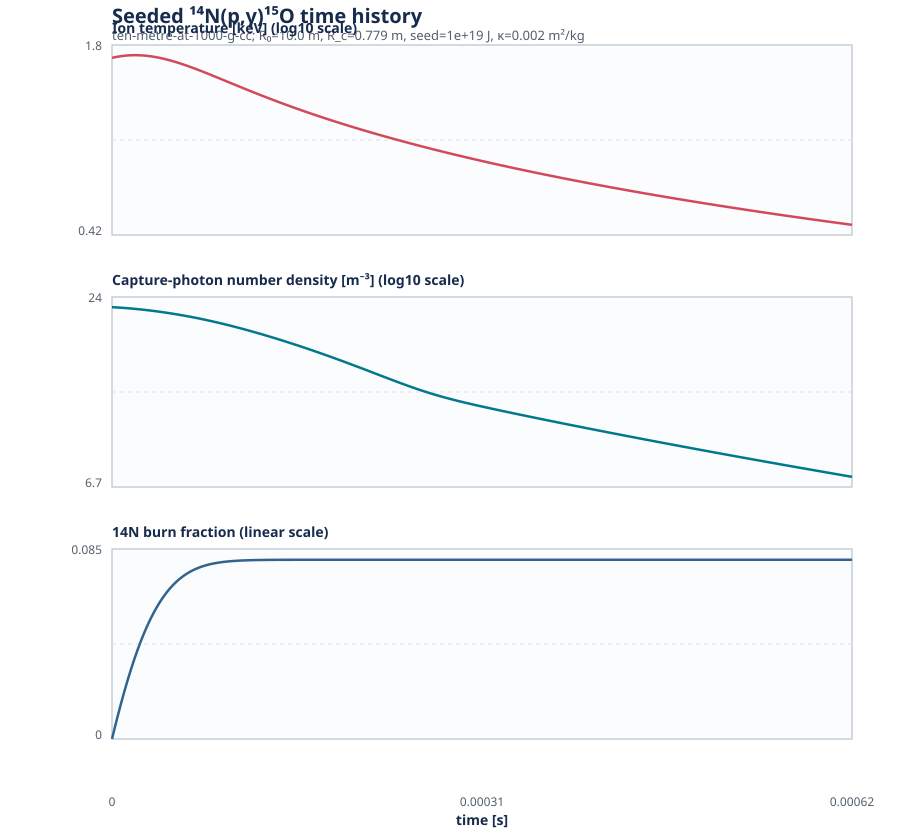

# Archived: Uniform-Seed 0-D ¹⁴N(p,γ)¹⁵O Burn Screen — 2026-09-03

[← Analysis plan](../../README.md) · [Seeded-model boundary](../../seeded-burn-model.md) · [Input sweep](../../data/sweeps/n14-radiation-benchmark.json) · [Reaction record](../../../reactions/n14-p-g-o15.md)

> **Archived model boundary.** This model applies its stated thermal seed to
> the *entire* compressed core. It is retained as a numerical/energy-ledger
> diagnostic, not an ignition requirement. Active work now uses a central
> ignitor plus cold-shell propagation screen.

## What this screen asks

This revision separates two questions that the prior cold-compression screen
blurred together. It **does not** calculate how a D-T pusher deposits energy.
It starts at peak compression with a specified, uniformly mixed equivalent
thermal seed and asks whether the $^{14}$N+$p$ core burns before its prescribed
hydrodynamic expansion and radiation losses.

The seed is therefore an ignition-sufficiency coordinate, not a claim that an
actual D-T shell deposits that energy uniformly. The required driver model is
listed in [the seeded-model boundary](../seeded-burn-model.md).

## Physical-density reference geometries

The no-void $^{14}$N/H reference composition has
$\rho_0=0.4718\ \mathrm{g\,cm^{-3}}$. Both cases use the same density
compression, $C_\rho\simeq2.12\times10^3$, to reach approximately
$10^3\ \mathrm{g\,cm^{-3}}$.

| Core | $R_0$ | $R_c$ | Core mass | Peak density |
| --- | ---: | ---: | ---: | ---: |
| Small reference | $3\ \mathrm m$ | $0.234\ \mathrm m$ | $53.4\ \mathrm{t}$ | $994\ \mathrm{g\,cm^{-3}}$ |
| Large reference | $10\ \mathrm m$ | $0.779\ \mathrm m$ | $1.98\times10^3\ \mathrm{t}$ | $998\ \mathrm{g\,cm^{-3}}$ |

The gray mass-energy absorption coefficient is held at the central sensitivity
value $\kappa=2\times10^{-3}\ \mathrm{m^2\,kg^{-1}}$ for the summary below.
At peak compression the initial optical depths are about 465 and 1555,
respectively. Thus capture gamma rays are retained in this gray model; this
run is testing heating and burn timing, not a transparent-core limit.

## First seeded results

| Core | Deposited seed | Initial $T_i$ | Burn after $5t_{\rm hydro}$ | Nuclear energy generated | Reading |
| --- | ---: | ---: | ---: | ---: | --- |
| Large | $10^{17}\ \mathrm J$ | $0.525\ \mathrm{keV}$ | negligible | $1.38\times10^6\ \mathrm J$ | Far below useful burning. |
| Large | $10^{19}\ \mathrm J$ | $52.4\ \mathrm{keV}$ | 8.04% | $7.46\times10^{18}\ \mathrm J$ | Meaningful burn, but generated energy is still below this test seed. |
| Small | $10^{17}\ \mathrm J$ | $19.4\ \mathrm{keV}$ | negligible | $6.02\times10^{12}\ \mathrm J$ | Below useful burning. |
| Small | $10^{19}\ \mathrm J$ | $1.94\times10^3\ \mathrm{keV}$ | 44.4% | $1.11\times10^{18}\ \mathrm J$ | Outside a credible rate/EOS domain; not a design point. |

The entire seed sweep, including opacity sensitivity and time histories, is
in the ignored generated file `n14-seeded-radiation-benchmark.csv`. This
Markdown file is the stable interpretation record.

The plotted case uses the large core and a $10^{19}\ \mathrm J$ seed because
it is the first point with appreciable burn. The photon-density panel is the
model's quasi-steady, gray capture-photon population—not a resolved radiation
spectrum. Temperature falls as the prescribed sphere expands; the burn curve
shows the resulting finite reaction completion.

## Takeaway

At the selected $\sim10^3\ \mathrm{g\,cm^{-3}}$ density, opacity is already
large in the gray model, but that alone does not make the core ignite. The
large core begins appreciable $^{14}$N capture only near the $10^{19}\ \mathrm J$
uniform-equivalent seed test. That point has 8% burn and generates
$7.5\times10^{18}\ \mathrm J$, so it is a useful **threshold bracket**, not
evidence of self-sustaining ignition.

The small-core $10^{19}\ \mathrm J$ result illustrates a limitation rather
than an advantage: the same absolute energy implies an implausibly high
temperature, where the chosen rate fit and one-temperature ideal-plasma EOS
are not suitable. Subsequent scans should use a seed-energy *density* or a
driver-coupling model, then reject points outside each reaction rate's stated
validity range.

## Next calculation

Keep the present $R_0/R_c$ geometry axes and add a D-T driver ledger for each
point: D-T inventory, burn fraction, energy channels, a bounded core-coupling
fraction, and an ignition-seed deposition time/depth. That will turn the
current $E_{\rm seed}$ coordinate into a pusher requirement while retaining
the useful burn-versus-disassembly calculation.

The next model should not continue to require a uniform whole-core seed. The
[central-ignitor burn-front screen](../../burn-front-screen.md) defines the
two-zone criterion: a self-heating hot spot, shell ignition, and a front that
outruns disassembly.
