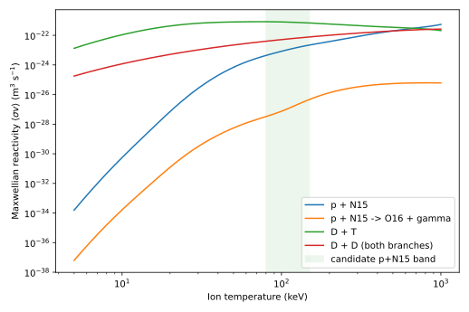
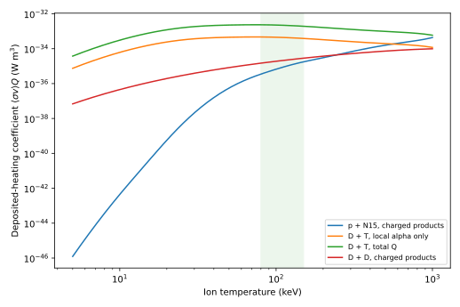
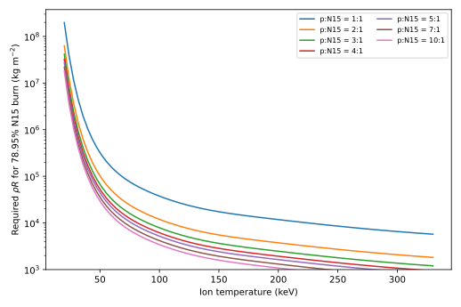
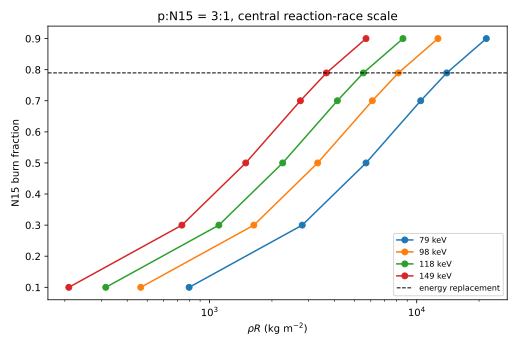
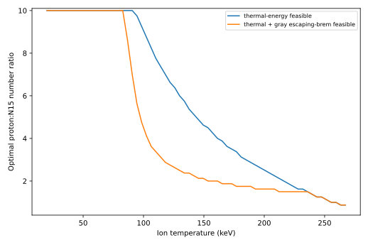
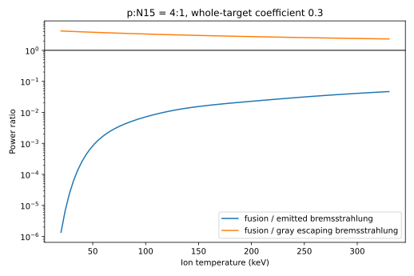
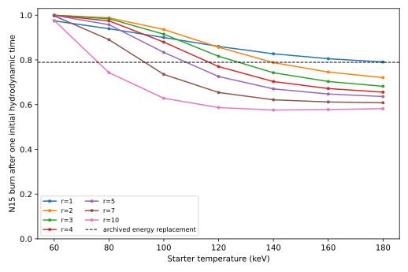

# N15 Secondary-Pusher v0.1 Audit

> **Superseded on 2026-09-06.** This first audit compared external N15 energy
> against an archived target calculation that had already counted the same
> N15 reaction as heat inside oven 1. Its 78.95%/96.72% coupling claims and
> resulting global energy comparison are withdrawn. The p+N15 reaction-rate,
> burn-time, radiation, stopping, and isolated-starter screens remain useful.
> Use the [v0.2 clean-separation audit](n15-secondary-pusher-v0.2-clean-separation-2026-09-06.md)
> for cycle energy bookkeeping.

[← Analysis](../README.md) · [Archived TOFEL-0D result](../archive/tofel-0d-2026-09-04/README.md)

## Executive result

The new architecture is materially different from mixing N15 into a D-T
pusher. The modeled sequence is:

$$
\text{fixed accelerator-lit D-T kernel}
\rightarrow \text{hot p+N15 starter}
\rightarrow \text{macroscopic p+N15 burn}
\rightarrow \text{CNO-core drive}.
$$

The first zero-D screen finds a **conditional reason to continue**, not a
demonstrated propagating pusher:

1. The cycle energy ledger is surprisingly favorable. One terminal
   N15(p,alpha)C12 reaction is already available per closed desired cycle and
   releases 4.966 MeV locally. The archived transport-deposition point required
   3.92060 MeV of ideal macro-pusher energy per cycle. Thus the internal N15
   carrier has 1.2666 times the required energy **at unit secondary-to-core
   coupling**. Even complete N15 burn requires at least 78.95% coupling; the
   selected 81.63%-burn point requires 96.72%. The older conservative
   5.54651-MeV requirement cannot close even at perfect coupling.
2. The p+N15 reaction is much slower than D-T. At 120 keV its REACLIB
   reactivity is $1.35\times10^{-23}$ m3/s, versus
   $7.59\times10^{-22}$ m3/s for D-T. At ordinary condensed mixture density,
   large areal columns are required.
3. The fixed-temperature no-loss optimum for replacing the 3.92060-MeV
   budget is near $r=n_p/n_{N15}=4.5$, $T=153$ keV. It requires
   $\rho R=2.52\times10^3$ kg/m2 and $R=10.6$ m for the central
   $C_h=1$ race, or $\rho R=8.40\times10^3$ kg/m2 and $R=35.4$ m for the
   whole-target $C_h=0.3$ scale.
4. Optically thin bremsstrahlung is fatal: throughout the interesting range,
   emitted bremsstrahlung exceeds deposited fusion power by roughly 50--1000
   times. A large target is optically thick, however. An optimistic gray
   reabsorption model turns this from a hard rejection into a radiation-
   transport question.
5. In the first leaky-box Model B, the smallest sampled case that reaches the
   required 78.95% N15 shot burn uses $r=3$, $T_0=120$ keV,
   $C_h=0.3$, and $R=60.4$ m. It reaches 81.63% burn and peaks at 155.5 keV.
   The same class of calculation with optically thin bremsstrahlung quenches.
6. A fixed 8-cm-radius D-T kernel is negligible when normalized over that
   enormous p+N15 batch—$8.66\times10^{-9}$ burned D-T pairs per burned N15
   reaction—but its equivalent 0.130-m hot p+N15 region burns only 1.33% of
   its N15 in one isolated sound crossing. The tiny ledger cost therefore
   assumes the surrounding cold mass can confine that starter and support a
   propagating front. That propagation has not been established.

The next decisive calculation is therefore a radial radiation/charged-particle
burn wave. The zero-D result has survived far enough to justify that work, but
only because photon trapping is credited optimistically.

## 1. Model scope and assumptions

The new model is **N15 Secondary Pusher 0-D v0.1**. It does not modify or
overwrite TOFEL-0D. The archived result is pinned to Git commit `817fc3b` in
[`analysis/archive/tofel-0d-2026-09-04/`](../archive/tofel-0d-2026-09-04/README.md).

The p+N15 target starts uncompressed. Its bulk density uses additive volumes
of condensed nitrogen at 808 kg/m3 and condensed hydrogen at 70.8 kg/m3:

$$
\rho^{-1}=\frac{15}{15+r}\rho_N^{-1}
+\frac{r}{15+r}\rho_H^{-1}.
$$

This is a transparent mixture closure, not a demonstrated cryogenic material.
At $r=3$, it gives 295.39 kg/m3.

The thermonuclear rates are from the repository's checksum-pinned JINA
REACLIB snapshot. JINA documents the summed seven-parameter rate form and notes
that fits should not be used outside their fitted range without physical
constraints; the selected snapshot does not state a validity range for this
entry. See the [JINA fitting documentation](https://reaclib.jinaweb.org/help.php?intCurrentNum=0&topic=rate_fitting).
A reaction-specific high-temperature evaluation and uncertainty band remain
required before treating the extrapolated screen as design data.

## 2. Reactivity comparison

| $T_i$ (keV) | p+N15 (m3/s) | D-T (m3/s) | D-D, both branches (m3/s) |
| ---: | ---: | ---: | ---: |
| 80 | $4.40\times10^{-24}$ | $8.34\times10^{-22}$ | $4.02\times10^{-23}$ |
| 100 | $8.41\times10^{-24}$ | $8.05\times10^{-22}$ | $5.16\times10^{-23}$ |
| 120 | $1.35\times10^{-23}$ | $7.59\times10^{-22}$ | $6.26\times10^{-23}$ |
| 150 | $2.22\times10^{-23}$ | $6.86\times10^{-22}$ | $7.81\times10^{-23}$ |

The evaluated competing N15(p,gamma)O16 branch is small in this library:
its rate is $7.4\times10^{-5}$ to $2.1\times10^{-4}$ of the alpha branch from
80 to 150 keV. Other high-energy side channels have not yet been added.



Multiplying each rate by its locally charged-product energy gives the
density-independent deposited-heating coefficient below. The D-T total-Q
curve is shown separately to prevent its neutron energy from being mistaken
for prompt local burn-wave heating. For D-D, the charged-product curve counts
the full proton+triton branch energy and only the He3 recoil in the neutron
branch.



## 3. Finite depletion and required rho-R

For $r=n_p/n_{N15}$ and N15 burn fraction $f$, constant-volume depletion is
integrated exactly. For $r\ne1$, the time to burn fraction $f$ is

$$
t_f=\frac{\ln[(r-f)/(r(1-f))]}
{(r-1)n_{N15,0}\langle\sigma v\rangle},
$$

and for $r=1$ it reduces to

$$
t_f=\frac{f}{(1-f)n_{N15,0}\langle\sigma v\rangle}.
$$

The radius is set by $t_f=C_hR/c_s$. The calculation reports both $C_h=1$
for a central rarefaction race and $C_h=0.3$ as the conservative whole-target
coefficient. It does not pretend that either coefficient is a radial solution.

The generalized whole-mixture thermal energy per initial N15 is

$$
E_{th}=(12+3r)T\quad\text{keV}.
$$

The familiar 331-keV absolute ceiling applies only at $r=1$ and complete burn.
Extra protons lower it:

$$
T_{max}=\frac{4966 f}{12+3r}\quad\text{keV}.
$$

For the archived transport-deposition energy requirement,

$$
f_{replace}=\frac{0.2229009102(17.589)}{4.966}=0.78948935.
$$

More generally, the burn/coupling condition is

$$
f_{N15}\eta_{N15\rightarrow macro}\geq0.78948935.
$$

This exposes the narrow energy margin. A complete terminal burn still needs
$\eta_{N15\rightarrow macro}\geq78.95\%$. The selected leaky-box result at
$f_{N15}=81.63\%$ needs $\eta\geq96.72\%$. This audit does not model that
hydrodynamic transfer efficiency; it uses unity only to ask whether the
concept survives an absolute energy bound.

| Constraint | $C_h$ | Best $r$ | $T$ (keV) | $R$ (m) | $\rho R$ (kg/m2) |
| --- | ---: | ---: | ---: | ---: | ---: |
| Thermal energy only | 1.0 | 4.5 | 153.4 | 10.61 | 2520 |
| Thermal + gray escaping-brem power | 1.0 | 1.5 | 235.8 | 10.36 | 4298 |
| Thermal energy only | 0.3 | 4.5 | 153.4 | 35.38 | 8400 |
| Thermal + gray escaping-brem power | 0.3 | 4.5 | 153.4 | 35.38 | 8400 |

The rough earlier suggestion $r\sim3$--4 was close: the energy/rate optimum is
near 4.5 in the present grid. Proton enrichment is not free; it improves the
rate per N15 but adds heat capacity and lowers condensed mixture density.



The same finite-depletion solution viewed in the other direction gives burn
fraction versus areal column. The plotted coefficient is the central
$C_h=1$ reaction race; a whole-target $C_h=0.3$ interpretation requires
3.33 times the column at the same burn fraction.



The optimal proton enrichment is temperature-dependent rather than a fixed
input. The following plot minimizes required $\rho R$ at every temperature,
subject first to the total thermal-energy constraint and then also to the
optimistic gray escaping-bremsstrahlung power constraint.



## 4. Bremsstrahlung and photon trapping

The emitted free-free power uses the classical lower-bound screen

$$
P_{brem}=5.35\times10^{-37}g_B\sqrt{T_{keV}}\,
n_e\sum_i n_iZ_i^2\quad\text{W m}^{-3},
$$

with $g_B=1.2$. Burning one N15+p pair into C12+He4 lowers
$\sum n_iZ_i^2$ by $10n_{N15,0}$, while electron number is conserved.

At the $r=3$, 120-keV reference point,

$$
\frac{P_{fus}}{P_{brem,emitted}}=0.00884.
$$

Thus an optically thin p+N15 plasma cannot self-heat. Relativistic corrections
would increase, not rescue, the radiation loss at these temperatures.

The target is not optically thin in the gray estimate. Using only the
Klein-Nishina electron-scattering opacity at characteristic photon energy
$E_\gamma=kT$, the 60.4-m reference has optical depth 281.4 and a uniform-
sphere single-flight escape fraction 0.002665. If all nonescaping radiation is
promptly recycled, then

$$
\frac{P_{fus}}{P_{brem,escape}}=3.32.
$$

This is an optimistic bound. Compton redistribution, inverse bremsstrahlung,
photon diffusion time, spectral transport, surface cooling, and a cold outer
layer must be evolved explicitly. The result says only that high-Z
bremsstrahlung is not automatically an external loss for a tens-of-metres
target.



## 5. Model-B self-heating trajectories

Model B evolves N15 and proton depletion and one plasma temperature for one
initial hydrodynamic time:

$$
\frac{dU}{dt}=P_{fus,dep}-P_{brem,escape}
-\chi_{exp}\frac{U}{\tau_h}.
$$

It holds density and radius fixed while representing expansion by the last
loss term. This is internally useful but not a hydrodynamic model.

| Case | $C_h$ | $r$ | $T_0$ (keV) | $R$ (m) | $f_{N15}$ | $T_{peak}$ (keV) | Outcome |
| --- | ---: | ---: | ---: | ---: | ---: | ---: | --- |
| Optically thin brem, expansion | 1.0 | 10 | 180 | 7.93 | 0.0157 | 180 | quenched |
| Gray trapped brem, expansion | 1.0 | 4 | 120 | 16.55 | 0.2285 | 120 | quenched |
| Gray trapped brem, expansion | 0.3 | 4 | 120 | 55.16 | 0.7702 | 141.3 | finite burn |
| Gray trapped brem, expansion | 0.3 | 3 | 120 | 60.42 | **0.8163** | **155.5** | finite burn |
| Gray trapped brem, expansion | 0.3 | 5 | 100 | 77.43 | 0.8336 | 127.7 | finite burn |

The selected reference is the smallest sampled trapped/expanding target that
exceeds $f_{replace}$. It contains about $2.73\times10^8$ kg of p+N15 mixture,
including $2.27\times10^8$ kg of N15 before burn. This huge inventory is a
direct consequence of uncompressed operation and the slow reaction rate.



## 6. Charged-product stopping

The official [NIST ASTAR](https://physics.nist.gov/PhysRefData/Star/Text/ASTAR.html)
CSDA range for a 3.72-MeV alpha in cold neutral nitrogen is
0.002781 g/cm2 = 0.02781 kg/m2. At the $r=3$ mixture density this corresponds
to only 94 micrometres, or $1.56\times10^{-6}$ of the 60.4-m target radius.

The 1.24-MeV carbon recoil is slower and has charge 6, so the alpha range is
used as a deliberately conservative **upper bound** on its cold stopping
length: $\lambda_C<94$ micrometres. NIST explains that ASTAR ranges are CSDA
integrals of stopping power; these are cold-material data, not hot-plasma
stopping solutions.

This result establishes local deposition in cold material but not burn-wave
propagation. At 100--150 keV, electron thermal motion can lengthen charged-
particle stopping, and ion stopping becomes important. The hot alpha and C12
ranges remain an explicit missing input. Because the cold ranges are tiny,
the radial Model C must resolve a very thin deposition zone or show that
radiation/electron conduction carries ignition ahead of it.

## 7. D-T starter scale

The starter calculation assumes cryogenic D-T at 250 kg/m3, complete kernel
burn, unit handoff, and only the 3.52-MeV alpha energy as prompt local heating.
The word “radius” is explicit; the 4-cm row is included in case the proposed
8-cm size meant diameter.

| D-T kernel radius | Burned D-T pairs | Local alpha energy (J) | Equivalent 120-keV p+N15 hot radius | N15 burn in one isolated hot-region crossing | D-T pairs / burned N15 in 60.4-m batch | Reduction vs archived 0.2229 D-T/cycle |
| ---: | ---: | ---: | ---: | ---: | ---: | ---: |
| 0.04 m | $8.07\times10^{24}$ | $4.55\times10^{12}$ | 0.0648 m | 0.669% | $1.08\times10^{-9}$ | $2.06\times10^8$ |
| 0.08 m | $6.46\times10^{25}$ | $3.64\times10^{13}$ | 0.1296 m | 1.332% | $8.66\times10^{-9}$ | $2.57\times10^7$ |
| 0.25 m | $1.97\times10^{27}$ | $1.11\times10^{15}$ | 0.4051 m | 4.085% | $2.64\times10^{-7}$ | $8.43\times10^5$ |
| 0.30 m | $3.41\times10^{27}$ | $1.92\times10^{15}$ | 0.4862 m | 4.876% | $4.57\times10^{-7}$ | $4.88\times10^5$ |

These spectacular reduction factors are only batch-size arithmetic. The
isolated reaction-race column makes the missing handoff concrete: none of the
proposed 4--30 cm kernels heats a region that can burn enough of itself before
one local sound crossing.

At the selected $r=3$, 120-keV state, the fusion payback fraction for merely
replacing the starter's thermal energy is 50.75%. A freely unloading hot
region would need a 7.57-m radius to reach that fraction, corresponding to a
4.67-m-radius D-T kernel under the same perfect alpha handoff. Reaching the
full 78.95% macro-energy burn in one isolated crossing requires an 18.13-m hot
region and an 11.19-m D-T kernel. Batch-normalized over the 60.4-m target,
those two bounds cost 0.00172 and 0.02368 D-T pairs per completed cycle,
respectively—still about 130-fold and 9.4-fold below the archived pure-D-T
number, but nowhere near the formal $2.57\times10^7$ reduction of the 8-cm
row.

The actual geometry lies between neither simple endpoint in a known way. The
cold outer p+N15 mass can inertially tamp the hot spot and trap radiation, and
a successful front need not burn the entire starter before advancing. Those
are precisely the effects a radial calculation must demonstrate. Model B
assumes a uniformly hot target and therefore cannot prove the handoff. No
cycle-closure claim should use the small-kernel reduction factors until Model
C succeeds.

If D-D reactions make each starter triton with equal branches, the hybrid
support ledger consumes five D per kernel D-T burn, just as before. For the
8-cm row this would be $4.33\times10^{-8}$ D per completed cycle after batch
normalization, before neutron credits and real losses. T consumption is
$8.66\times10^{-9}$ per cycle.

With one desired cycle neutron captured into one D and no credit for the D-T
or D-D support neutrons, the conditional hybrid ledger is

$$
G_D=\frac{1}{5I},
$$

where $I$ is batch-normalized kernel D-T burns per completed cycle. The formal
8-cm propagating-front case gives $G_D=2.31\times10^7$. The isolated thermal-
payback and full-replacement reaction-race kernel sizes instead give
$G_D=116.2$ and $8.45$. For arbitrary external-H recovery probabilities,

$$
G_D=\frac{1+I(\eta_{DT,n}+\eta_{DD,n})}{5I}.
$$

These are material ledgers, not achieved reactor points. They apply only if
the N15 front and the required secondary-to-core coupling close; if either
fails, no large numerical $G_D$ rescues the architecture.

## 8. N14/N15/C12 material ledger

N15 is not free external fuel and it is not permanently destroyed as catalyst:

| Step per closed desired cycle | p | O17 | N14 | O15 | N15 | C12 | alpha | positron | $\nu_e$ | Role |
| --- | ---: | ---: | ---: | ---: | ---: | ---: | ---: | ---: | ---: | --- |
| O17+p -> N14+alpha | -1 | -1 | +1 | 0 | 0 | 0 | +1 | 0 | 0 | create internal N14 |
| N14+p -> O15+gamma | -1 | 0 | -1 | +1 | 0 | 0 | 0 | 0 | 0 | slow manufacture step |
| O15 beta+ -> N15 | 0 | 0 | 0 | -1 | +1 | 0 | 0 | +1 | +1 | cold wait and accumulation |
| withdraw/store N15 | 0 | 0 | 0 | 0 | 0 | 0 | 0 | 0 | 0 | inventory transfer only |
| N15+p -> C12+alpha | -1 | 0 | 0 | 0 | -1 | +1 | +1 | 0 | 0 | fast pusher discharge |

The last row is the terminal reaction already required to close the original
CNO loop. Using “all N14 reactions for pushing” therefore means storing and
time-shifting this terminal energy, not adding another N15 consumption.
Exactly one N15 terminal burn—and at most 4.966 MeV—is available per desired
cycle. Burning extra N15 requires extra fully charged carrier loops through
the slow N14(p,gamma) step.

If a shot burns only 81.6% of its loaded N15, the remaining enriched nitrogen
is assumed chemically recovered and returned to later pusher batches. C12 and
He ash are different elements and can be chemically separated. Fresh N15 made
from natural nitrogen would still require isotope handling; the current model
does not charge that work.

## 9. What is established and what is not

Established within the stated zero-D assumptions:

- the terminal N15 energy can cover the archived 3.9206-MeV ideal macro budget
  but not the 5.5465-MeV conservative bracket, and the former requires at
  least 78.95% p+N15-to-core coupling even at complete burn;
- the p+N15 fixed-T burn requires tens-of-metres whole-target scales without
  compression;
- the proton-ratio optimum is broad and lies near the proposed 3--5 range;
- optically thin bremsstrahlung kills the idea;
- sufficiently large gray opacity can reverse the escaping-radiation power
  balance in an optimistic treatment;
- a fixed 8--30 cm D-T starter becomes arithmetically negligible over a huge
  successful batch.

Not established:

- hot-plasma alpha and carbon stopping;
- a propagating p+N15 front from a sub-metre starter;
- spectral radiation diffusion and reabsorption on the burn timescale;
- hydrodynamic conversion of p+N15 energy into the three required CNO events;
- the shell thickness/core-size scaling—core compression work scales with
  inventory, so increasing ball size does not automatically make an energy-
  limited pusher free;
- side-reaction branching above the validated rate regime;
- real coupling, structures, recovery losses, or accelerator efficiency.

## Reproduction

```bash
MPLCONFIGDIR=/tmp/cno-matplotlib \
.env/bin/python analysis/archive/n15-pre-layered-2026-09-06/audit_n15_pusher.py \
  --config analysis/archive/n15-pre-layered-2026-09-06/reference.json \
  --output-directory analysis/archive/n15-pre-layered-2026-09-06/n15-pusher-v0.1
```

The script writes the complete reactivity, fixed-T, rho-R, self-heating,
starter, pusher-comparison, carrier-energy, and isotope-flow tables. Generated
CSVs are ignored by Git; the SVG plots and this audit preserve the result.
