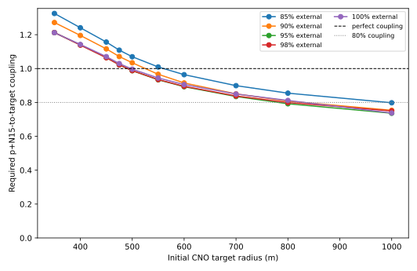

# N15 Secondary Pusher v0.3: Pressure-Limited Compression

[← Analysis](../README.md) · [Clean energy audit](n15-secondary-pusher-v0.2-clean-separation-2026-09-06.md) · [Archived D-T-pusher model](../archive/tofel-0d-2026-09-04/README.md)

> **Superseded for whole-system radii:** v0.3 prescribed pusher-to-target
> coupling and therefore did not calculate the momentum exchange that sets
> pusher and tamper size. Its CNO target requirements and preheating results
> remain useful. Use the [v0.4 layered pressure-driver reference](n15-layered-reference-v0.4-2026-09-06.md)
> for the current single-oven geometry.

## Short answer

There is now a zero-dimensional implosion model in which compression is an
answer, not an input. A cold pusher gives a uniform target inward motion. Cold
electron pressure, deliberate late heating, and nuclear heat then slow that
motion. Maximum compression is the point where the remaining inward kinetic
energy reaches zero.

The model confirms the proposed trade: N15 mixed into the first CNO target can
act as a match, but if it burns early its pressure reduces compression. In a
controlled example, allowing the heat from a 5% N15 mixture to act reduced
maximum compression from **27,559** to **18,364**, a 33% loss, at the same
pusher impulse. It raised the stagnation temperature from 73.2 to 88.0 keV.

A coarse whole-system grid found:

| Interpretation | Initial CNO core radius | N15 external / mixed | Target energy per cycle | Required pusher-to-target coupling | Largest lower-bound outer radius |
| --- | ---: | ---: | ---: | ---: | ---: |
| Mathematical edge, perfect-coupling bound | 500 m | 95% / 5% | 4.65894 MeV | 98.75% | 566 m |
| Less fragile 80%-coupling screen | 800 m | 95% / 5% | 3.73741 MeV | 79.22% | 929 m |



This is real progress, but it is **not yet a working reactor point**. The CNO
implosion and material-energy ledgers close conditionally. The calculation
still does not show that a small D-T kernel can heat and launch a burn wave
through the full p+N15 blanket. That handoff is now the largest missing piece.

## Compression equation

Let

$$
C=\left(\frac{R_0}{R}\right)^3
$$

be density compression. A uniform sphere with velocity proportional to radius
has inward kinetic energy

$$
K=\frac{3}{10}M v_s^2,
$$

where $v_s$ is the inward surface speed. During the hot part of the implosion,
the code evolves

$$
\frac{dC}{dt}=\frac{3v_s C^{4/3}}{R_0},
$$

$$
\frac{dK}{dt}=-(P_{cold}+P_{hot})\left(-\frac{dV}{dt}\right),
$$

and

$$
\frac{dE_{hot}}{dt}
=P_{hot}\left(-\frac{dV}{dt}\right)
+\sum_j Q_j\frac{d\xi_j}{dt}-L_{rad}.
$$

The reaction extents $\xi_j$ come from simultaneous finite-depletion rate
equations. $P_{cold}$ and the reversible cold work use the zero-temperature
relativistic electron Fermi gas. $P_{hot}$ comes from ions plus the
finite-temperature electron excitation above that cold curve. This prevents
the old double count of zero-temperature degeneracy and classical electron
heat.

Before the match is fired, the especially simple relation is

$$
K(C)=K_0-[U_{e,0}(C)-U_{e,0}(1)].
$$

After firing, hot pressure drains the remaining $K$. Stagnation, and therefore
$C_{max}$, occurs at $K=0$.

The timing penalty can also be seen without the ODE. For an ideal hot component
with adiabatic index $\gamma$, heat $dQ$ released at compression $C_q$ is
amplified by later compression. By $C_{max}$ it has made the pusher supply an
extra

$$
dW_{early}=dQ\left[
\left(\frac{C_{max}}{C_q}\right)^{\gamma-1}-1
\right].
$$

Heat released near peak compression has little time to brake the inward
motion. The same heat released much earlier can consume a large part of the
inward kinetic reservoir. This is the mathematical version of the match going
off too soon. The qualitative dependence is consistent with standard ICF
descriptions of higher preheat/adiabat reducing compressibility; see the
[LLNL NIF glossary](https://lasers.llnl.gov/education/glossary) and the
[OSTI review of ICF physics](https://www.osti.gov/pages/servlets/purl/1992495).

## Conservative disassembly rule

The old static model granted a target one fixed sound-crossing time at its
prescribed peak density. This model does not. At stagnation, pressure begins a
homologous outward acceleration. Density and temperature then fall according
to the same energy and pressure equations. The conservative score counts burn
only until density has fallen to one-half of its peak value.

That brief post-stagnation interval is important. It is neither an instant
cutoff nor an artificial motionless hold. A central-region interpretation can
be generated by allowing more expansion, but it is not used for the reported
closure points.

## Selected CNO parameters

All three rows are separate sequential implosion events. They are not three
materials mixed into one ball. Starting density is 500 kg/m3 in every row.

### 500-m perfect-coupling edge

| Oven | Reactions | Trigger C | Achieved C | Peak radius | Peak T | Completion after disassembly | Input per completion |
| --- | --- | ---: | ---: | ---: | ---: | ---: | ---: |
| 1 | mixed N15+p; C12+p | 100,000 | 260,933 | 7.82 m | 57.6 keV | N15 100%; C12 93.61% | 0.41893 MeV |
| 2 | C13+alpha; O16+p | 1,000,000 | 1,210,317 | 4.69 m | 183.7 keV | C13 99.91%; O16 56.03% | 2.91009 MeV |
| 3 | O17+p; N14+p | 300,000 | 484,781 | 6.36 m | 31.6 keV | O17 100%; N14 56.93% | 1.32992 MeV |

The three costs total 4.65894 MeV. The external 95% of the terminal N15
reaction supplies 4.71770 MeV, leaving only a 1.25% coupling margin.

### 800-m, 80%-coupling screen

| Oven | Trigger C | Achieved C | Peak radius | Peak T | Completion after disassembly | Input per completion |
| --- | ---: | ---: | ---: | ---: | ---: | ---: |
| 1 | 100,000 | 103,048 | 17.06 m | 40.4 keV | N15 100%; C12 85.49% | 0.39146 MeV |
| 2 | 1,000,000 | 1,188,311 | 7.55 m | 190.3 keV | C13 99.96%; O16 70.47% | 2.31380 MeV |
| 3 | 300,000 | 481,663 | 10.21 m | 98.7 keV | O17 100%; N14 73.35% | 1.03216 MeV |

These sum to 3.73741 MeV. Dividing by the 4.71770 MeV in the external 95% of
N15 gives 79.22% required transfer.

The non-unit completion fractions are amortized: unburned CNO material is
assumed recoverable and retried. The energy column is already divided by the
number of successful endpoint reactions. The model does not charge a full
pusher once per failed individual nucleus.

## Blanket and proton-ratio optimization

The pusher scan varies $r=n_p/n_{N15}$ as part of the *whole-system* size
objective. It requires a hot uniform box to burn at least 80% of its N15 while
including finite depletion, gray trapped bremsstrahlung, and an expansion-loss
term with the conservative $C_h=0.3$ clock.

The smallest standalone reaction-race layer was not the smallest complete
machine. A proton ratio near 2.5 gives a thinner standalone layer, but the
mixture is less dense and needs a thicker mass-matched shell around the large
CNO core. The coarse whole-system grid instead selected $r=1.5$.

| Design | Pusher initial T | Hot-box burn | Oven-1 blanket | Oven-2 blanket | Oven-3 blanket |
| --- | ---: | ---: | ---: | ---: | ---: |
| 500-m edge | 220 keV | 82.17% | 50.0 m | 66.3 m | 50.0 m |
| 800-m / 80% coupling | 120 keV | 88.77% | 100.0 m | 129.1 m | 100.0 m |

Each blanket value is the larger of:

1. the thickness containing the required pusher mass at its uncompressed
   additive-volume density; and
2. the thickness required by the p+N15 reaction/disassembly race.

The calculation assumes 80% blanket burn and includes the corresponding
loaded, recoverable N15 inventory. The 500-m design's largest outside radius is
500 + 66.3 = 566.3 m. The 800-m design's is 800 + 129.1 = 929.1 m.

## What is and is not established

Established inside this model:

- early mixed-N15 heating has a direct, energy-conserving compression penalty;
- a late match can reduce the separate heating bill enough for a small mixed
  fraction to be useful;
- 5% mixed / 95% external is favored on this coarse grid;
- conditional macro energy closure first appears around a 500-m starting
  radius at nearly perfect transfer;
- an 80%-transfer screen first closes at 800 m on the tested radius grid;
- optimizing proton ratio for total outer size can differ from optimizing the
  p+N15 layer alone.

Not established:

- a propagating p+N15 burn front from the fixed D-T kernel;
- a way to heat the listed 50--100 m uniform pusher starter volume with the
  small D-T kernel;
- realistic conversion of p+N15 pressure into 79% mechanical energy in the
  CNO cores;
- stability, shocks, interfaces, ablation, or multi-shell timing;
- radiation diffusion rather than the present trapped-target and gray-pusher
  bounds;
- side reactions at the high temperatures reached in ovens 2 and 3;
- survival or construction of matter at the million-fold compressions;
- a converged optimum. Trigger compression and the candidate grid are still
  deliberately sparse.

Most importantly, the blanket hot-box begins uniformly hot. It is a necessary
reaction-versus-disassembly test, not the requested radial proof that a small
D-T starter launches a traveling p+N15 burn. Until that radial handoff exists,
the reported sizes should be read as conditional design targets.

## Reproduction

```bash
MPLCONFIGDIR=/tmp/cno-matplotlib \
.env/bin/python analysis/scripts/optimize_n15_dynamic_system.py \
  --config analysis/data/n15-pusher/dynamic-preheat.json \
  --output-directory analysis/results/n15-pusher-v0.3
```

The output CSVs contain the event energy split, trigger settings, achieved
compression, reaction extents, system closure sweep, and mass/race blanket
thicknesses.
