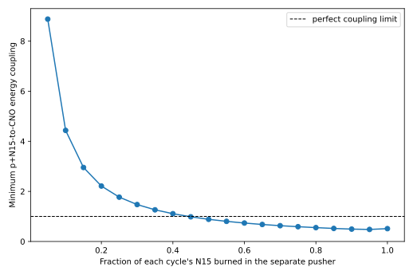

# N15 Secondary Pusher v0.2: Clean-Separation Audit

[← Analysis](../README.md) · [v0.3 dynamic-preheat model](n15-dynamic-preheat-v0.3-2026-09-06.md) · [Superseded v0.1 audit](n15-secondary-pusher-v0.1-2026-09-05.md) · [Archived D-T-pusher model](../archive/tofel-0d-2026-09-04/README.md)

## Short answer

The previous comparison mixed two jobs together and counted the N15 reaction
in both of them. This audit separates the materials into three boxes:

1. **D-T starter:** the small accelerator target that lights the p+N15 shell.
2. **p+N15 pusher:** burns N15 outside the CNO target and makes the pressure
   pulse.
3. **CNO target:** receives that pulse and runs the other CNO reactions.

In the clean baseline, no N15 is mixed into the CNO target. Its pusher reaction
is counted exactly once.

With the old target sizes, densities, and compressions held fixed, the three
CNO targets need **2.547 MeV of starting energy per completed cycle**. One
successful external N15 reaction releases 4.966 MeV, so the minimum transfer
from the N15 shell into the CNO targets is

$$
\eta_{N15\rightarrow CNO}
=\frac{2.547}{4.966}
=0.5129.
$$

That is the corrected clean-separation number. The earlier 78.95% and 96.72%
claims are withdrawn.

This still does not prove that the p+N15 shell ignites or that 51% mechanical
coupling is achievable. It only fixes the energy bookkeeping.

## What the mistaken numbers meant

The earlier 3.9206-MeV and 5.5465-MeV values came from the archived D-T-pusher
model. They were the total D-T fusion energy charged per successful cycle.
They did **not** represent energy escaping from the p+N15 shell.

Both old calculations already put N15 inside oven 1 and credited all
N15(p,alpha) energy as local heat. The two cases differed in whether the other
CNO capture gammas and the C13 neutron were also allowed to heat the targets.
Reusing 4.966 MeV from that same N15 reaction as a new external pusher without
removing it from oven 1 counted the reaction twice.

The v0.2 calculation removes that overlap.

## Clean target calculation

The target geometry is not reoptimized. Each target keeps the archived
$R_0=1000$ m, starting density 500 kg/m3, compression ratio, and one
sound-crossing dwell. Only the starting temperature is scanned because moving
N15 out of oven 1 removes its old in-target preheating.

| CNO target | Reactions inside target | Compression | Starting temperature | Completion | Starting energy per completion |
| --- | --- | ---: | ---: | ---: | ---: |
| 1 | C12+p -> N13 | $3\times10^4$ | 34 keV | 0.9363 | 0.52796 MeV |
| 2 | C13+alpha -> O16+n; O16+p -> F17 | $10^6$ | 52 keV | 0.8888 | 1.38755 MeV |
| 3 | O17+p -> N14+alpha; N14+p -> O15 | $3\times10^5$ | 22 keV | 0.9064 | 0.63154 MeV |
| **Total** |  |  |  |  | **2.54705 MeV** |

“Starting energy” means the energy needed to compress the material and bring
it to the listed starting temperature. Energy released later by reactions
inside that target is allowed to heat the same target. The N15 pusher reaction
is not among those internal reactions.

If oven 1 were left at its old 20-keV starting temperature after removing its
N15, almost none of its C12 would react. Raising it to roughly 34 keV crosses a
strong self-heating threshold: the C12 capture gammas are trapped in the huge
target and the reaction runs away in this zero-D model. This is why the
temperature had to be rescanned even though the geometry was frozen.

## Does mixing a little N15 into target 1 help after compression?

In the present energy-only calculation, yes, slightly. It acts like a match
inside the C12 target. This is not yet a physical mixture optimum.

Let $x$ be the fraction of each cycle's N15 burned in the separate pusher.
The remaining $1-x$ is mixed into target 1. N15 energy released inside target
1 is counted there and is not also counted as pusher energy.

| N15 in separate pusher | N15 mixed into target 1 | Target-1 start | Total CNO starting energy | External N15 energy | Required coupling |
| ---: | ---: | ---: | ---: | ---: | ---: |
| 45% | 55% | 10 keV | 2.20075 MeV | 2.23470 MeV | 98.48% |
| 50% | 50% | 10 keV | 2.19843 MeV | 2.48300 MeV | 88.54% |
| 75% | 25% | 11 keV | 2.20066 MeV | 3.72450 MeV | 59.09% |
| 90% | 10% | 12 keV | 2.20875 MeV | 4.46940 MeV | 49.42% |
| 95% | 5% | 16 keV | 2.26807 MeV | 4.71770 MeV | **48.08%** |
| 100% | 0% | 34 keV | 2.54705 MeV | 4.96600 MeV | 51.29% |

The coarse **post-compression energy sweep** prefers roughly 94--95% of the
N15 in the pusher and only 5--6% mixed into target 1. That small mixed fraction
supplies enough local heat to lower target 1's starting-energy bill. Putting
much more N15 in the target weakens the separate pusher faster than it helps
preheating.

The improvement is modest: required coupling falls from 51.29% to about
48%. The clean 100%-pusher case should therefore remain the baseline; the
small mixed starter is an optional refinement.

There is an important missing penalty. The zero-D calculation starts its
reaction clock only after the target has already reached the prescribed final
density and temperature. It therefore guarantees that the N15 match cannot
fire too early. In a real inward-moving target, early N15 burn raises pressure
and entropy before maximum compression. That pressure fights the inward
motion, so the target reaches a lower density and may lose more reaction rate
than the early heat provides.

The real optimum must balance three effects:

1. too little mixed N15 gives inadequate late preheating;
2. too much, or ignition too early, spoils compression;
3. N15 kept in the separate shell remains available as pusher energy.

Consequently 5--6% is only a candidate for a later implosion-timing model. It
must not be used as the recommended physical mixture. The clean 0%-mixed
baseline remains the only result that does not depend on controlling this
timing.



## What remains unchanged

This correction does not solve the difficult pusher physics found in v0.1:

- optically thin p+N15 still loses far too much energy as bremsstrahlung;
- the favorable self-heating case still relies on trapping that radiation in
  a target tens of metres across;
- an 8-cm D-T kernel still heats a p+N15 region that reacts too slowly if it is
  allowed to expand freely;
- a radial burn front and the actual transfer of pusher pressure into each CNO
  target remain unproved.
- a time-dependent inward implosion is needed to determine when mixed N15
  ignites and how much compression that early pressure destroys.

It only gives that future radial model the correct energy target: about
2.55 MeV per completed cycle for the clean design, or about 2.27 MeV with the
small mixed-N15 match.

## Reproduction

```bash
MPLCONFIGDIR=/tmp/cno-matplotlib \
.env/bin/python analysis/scripts/audit_n15_clean_separation.py \
  --config analysis/data/n15-pusher/clean-separation.json \
  --output-directory analysis/results/n15-pusher-v0.2
```

The generated CSVs contain every tested temperature, reaction completion,
starting-energy cost, N15 allocation, and coupling threshold.
