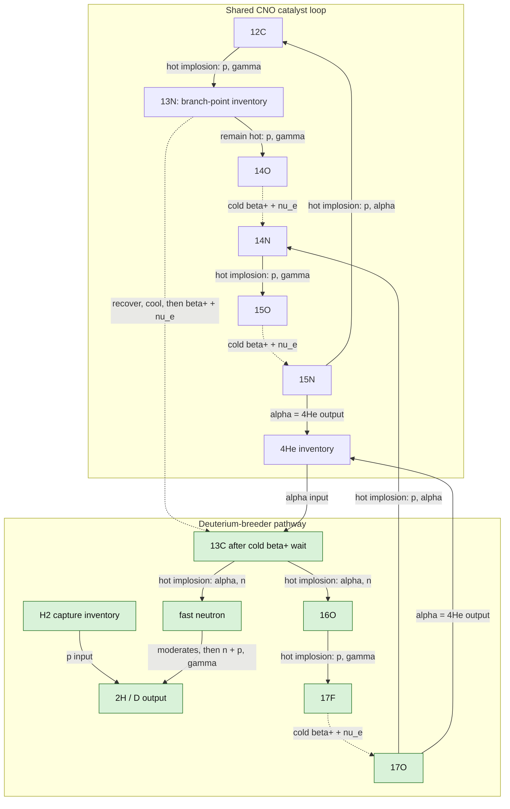

# Fuel Cycle

[← Study navigation](../README.md)

The study keeps two pathways alive until quantitative modeling can eliminate one. The strategic test is not merely net nuclear energy: the full cycle must make enough deuterium to cover any non-negligible D-T ignition and compression demand.



Every box is an isotope or material inventory. Solid arrows are hot implosion reactions; dotted arrows are cold beta-decay/recovery steps. $^{13}N$ is the deliberate branch point: while it remains hot, $^{13}N(p,\gamma){}^{14}O$ feeds staged CNO; if it is recovered and cooled instead, its beta-plus decay makes $^{13}C$ for the breeder target. The neutron is released into the expanding shot environment and is ultimately moderated/captured by the hydrogen inventory; its oxygen product returns through ${}^{16}O\rightarrow{}^{17}F\rightarrow{}^{17}O$ and rejoins the shared loop at ${}^{14}N$.

## Candidate pathways

- [Staged CNO hydrogen burning](staged-cno.md) restores its CNO catalyst but does not produce surplus deuterium.
- [Catalytic deuterium breeder](deuterium-breeder.md) is more complex, but may close the isotope economy.
- [13N branch control](n13-branch-control.md) defines the target-design fork between $^{14}O$ energy-path production and $^{13}C$ breeder feed.
- [Lithium and tritium](lithium.md) begins the resource-bottleneck analysis for the complete $p \rightarrow D \rightarrow He$ route.
- [D–T / deuterium economy](dt-deuterium-economy.md) makes the breeder neutron, D–T pusher, and lithium-T counts explicit under a driver-energy budget.
- [Reactions required for steady D production](d-production-reaction-catalog.md) lists every hot reaction and cold recovery step that must close before one breeder neutron becomes repeatable D output.

## Closure criterion

The breeder is strategically viable only when deuterium produced exceeds deuterium consumed by its own trigger and compression system, with a margin sufficient to support the wider fusion economy.

## Three mechanisms, kept separate

### 1. Implosion reactions

Every **hot** reaction uses a cold, composition-specific reactive core surrounded by a solid D-T pusher, which is separately ignited and implodes the core. D-T is an input and is consumed; the pusher is not a source of the desired D product. The detailed [D-T pusher record](../reactions/dt.md) tracks its alpha heating, neutron output, temperature, density, and inventory cost.

The primary $^{12}C+p$ shot deliberately permits co-production of the energy-route and breeder-feed inventories; its proton loading and burn exposure set the split. After normal disassembly and decay, recovered $^{13}C$ and $^{14}N$ are chemically separated and routed onward. The later $^{13}C(\alpha,n){}^{16}O$ neutron-source reaction remains a linked design stub; see [its record](../reactions/c13-a-n-o16.md).

### 2. Cold decay and isotope handling

Beta-plus decays do not occur under inertial confinement. Products are recovered from a completed shot, cooled, isotopically sorted, held for their decay time, and loaded into the next appropriate target. Examples are $^{13}N\rightarrow{}^{13}C$ for the breeder and $^{15}O\rightarrow{}^{15}N$ for the return loop. This processing is a fuel-cycle mechanism, not a reactor dwell-time requirement.

| Parent made by hot reaction | Required post-shot change | Half-life | Daughter status | Cycle consequence |
| --- | --- | --- | --- | --- |
| $^{13}N$ from [$^{12}$C$(p,\gamma)$](../reactions/c12-p-g-n13.md) | $\beta^+/\epsilon\rightarrow{}^{13}C$ | $9.9584\ \mathrm{min}$ | $^{13}C$ stable | **Longest required wait.** $\sim33\ \mathrm{min}$ to 90%; breeder inventory staging is needed. |
| $^{14}O$ from [$^{13}$N$(p,\gamma)$](../reactions/n13-p-g-o14.md) | $\beta^+/\epsilon\rightarrow{}^{14}N^{(*)}$, prompt gamma if excited | $\sim70.62\ \mathrm{s}$ | $^{14}N$ stable | Minutes-scale return-inventory delay; excited-state gamma is an energy/transport ledger item, not an isotope split. |
| $^{15}O$ from [$^{14}$N$(p,\gamma)$](../reactions/n14-p-g-o15.md) | $\beta^+/\epsilon\rightarrow{}^{15}N$ | $\sim122.24\ \mathrm{s}$ | $^{15}N$ stable | Minutes-scale return-inventory delay. |
| $^{17}F$ from [$^{16}$O$(p,\gamma)$](../reactions/o16-p-g-f17.md) | $\beta^+/\epsilon\rightarrow{}^{17}O^{(*)}$, prompt gamma if excited | $64.385\ \mathrm{s}$ | $^{17}O$ stable | Minutes-scale breeder-return delay; tiny excited-state feed does not change daughter inventory. |

All four listed beta decays ultimately retain the desired mass-chain inventory;
none is presently a catastrophic fractional-decay loss. The problematic item is
operational, not nuclear: $^{13}N$ requires the largest buffer and recovery
throughput. Every beta-plus decay also exports neutrino energy, while positron
and gamma energy must be included in later radiation/recovery ledgers.

### 3. Hydrogen deuterium-breeder blanket

The current design has **one proposed breeder blanket**: a clean liquid-$H_2$ mantle outside the D-T pusher of the $^{13}C(\alpha,n){}^{16}O$ shot. It moderates the emitted neutron and performs

$$
n+p\rightarrow D+\gamma.
$$

It is a D breeder, not a T breeder. Its decisive metric is the source-to-recovered-deuterium efficiency $\eta_{n\rightarrow D}$, including pusher traversal, moderation, leakage, parasitic absorption, gamma handling, and isotope recovery. The [blanket record](../reactions/n-p-g-d.md) contains the first transport screen.

### Breeder-shot topology

```mermaid
flowchart LR
    C13[Stored 13C] --> Core[13C + 4He reactive core]
    He[Recovered 4He inventory] --> Core
    DT[Solid D-T pusher] -->|implodes| Core
    Core -->|13C(alpha,n)16O| O16[16O: return network]
    Core -->|13C(alpha,n)16O| n[fast neutron]
    n -->|traverses pusher| H2[clean liquid-H2 capture mantle]
    H2 -->|n(p,gamma)D| D[D recovered after cooling]
    O16 --> Return[O16 -> 17F -> 17O -> 14N -> 15O -> 15N -> 12C]
```

This is the sole breeder-blanket topology presently proposed. The hot $^{13}C+{}^4He$ shot makes the neutron; the external hydrogen mantle makes D. No lithium blanket or in-shot hydrogen capture is assumed in this route.

## Inputs, inventories, and replenishment

| Item | Role and source | Fate / replenishment |
| --- | --- | --- |
| Ordinary hydrogen | Bulk feedstock for proton captures; $H_2$ in the breeder blanket | One H nucleus per captured neutron becomes D. Bulk hydrogen is replenished by collection and recondensed after recovery. |
| $^{12}C$ catalyst | Seed inventory for the CNO loop | Regenerated by $^{15}N(p,\alpha){}^{12}C$; moved between isotope-specific targets rather than consumed once. |
| $^{13}C$ | Made by $^{12}C(p,\gamma){}^{13}N$, then cold $^{13}N$ decay | Consumed in the neutron-source shot; its $^{16}O$ product enters the return loop. |
| $^4He$/alpha inventory | Produced by alpha-emitting return steps | One alpha is loaded into each $^{13}C(\alpha,n)$ target. The proposed full network must prove that its recovered alpha inventory closes after losses. |
| $^{16}O$, $^{17}F$, $^{17}O$, $^{14}N$, $^{15}O$, $^{15}N$ | Intermediate catalyst inventory | Recovered, cooled/decayed as necessary, and routed through the return network to $^{12}C$. |
| Deuterium | Desired breeder output and D-T pusher input | D output must exceed D consumed by pusher/ignition use for closure. |
| Tritium | D-T pusher input | Consumed in every D-T pusher shot; replenishment mechanism remains unresolved and is tracked separately in [lithium and tritium](lithium.md). |
| D-T pusher material | Separate implosion driver around each hot-reaction core | Converted to $^4He$, neutrons, and energy; its isotope cost is charged to the pathway. |
