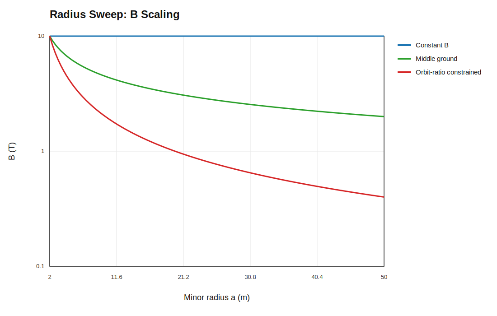
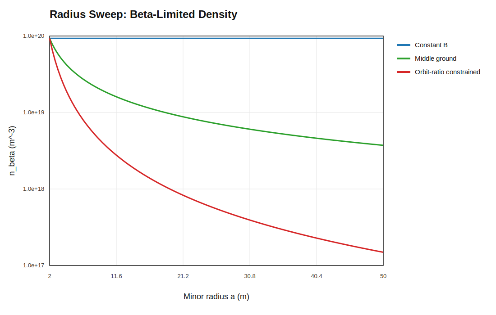
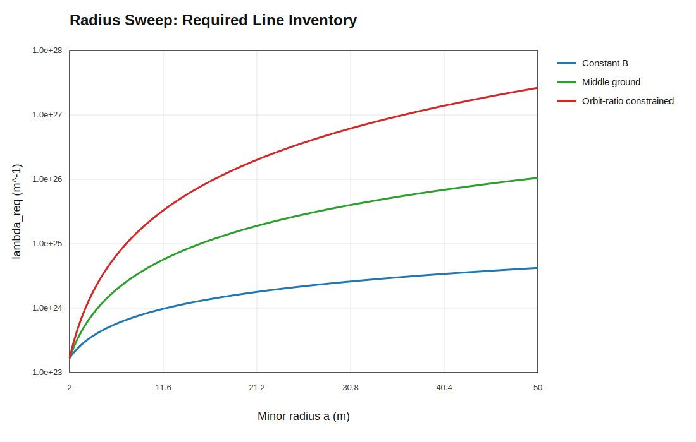
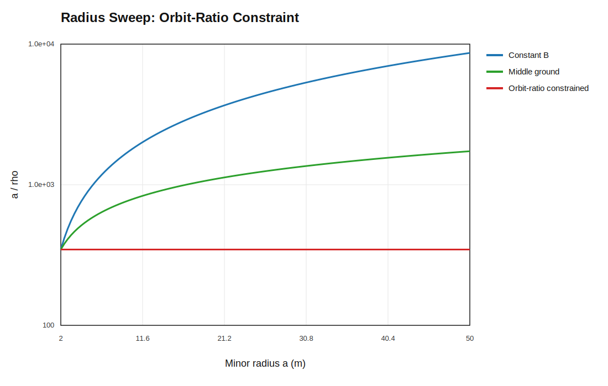
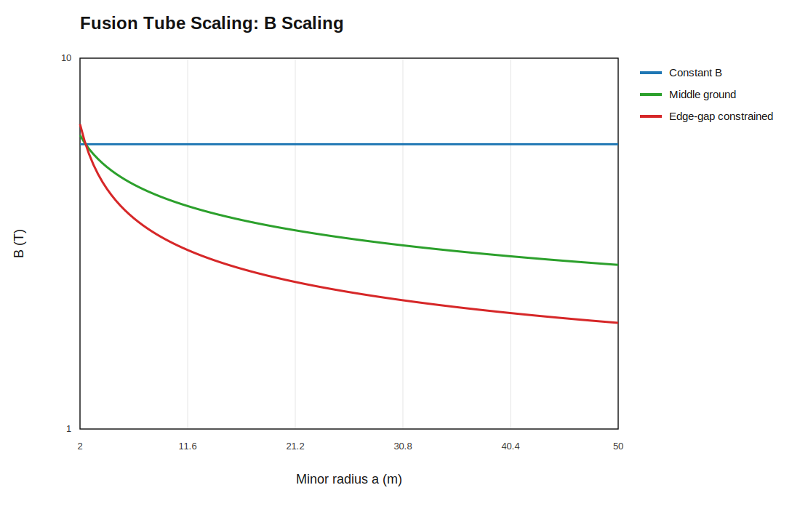
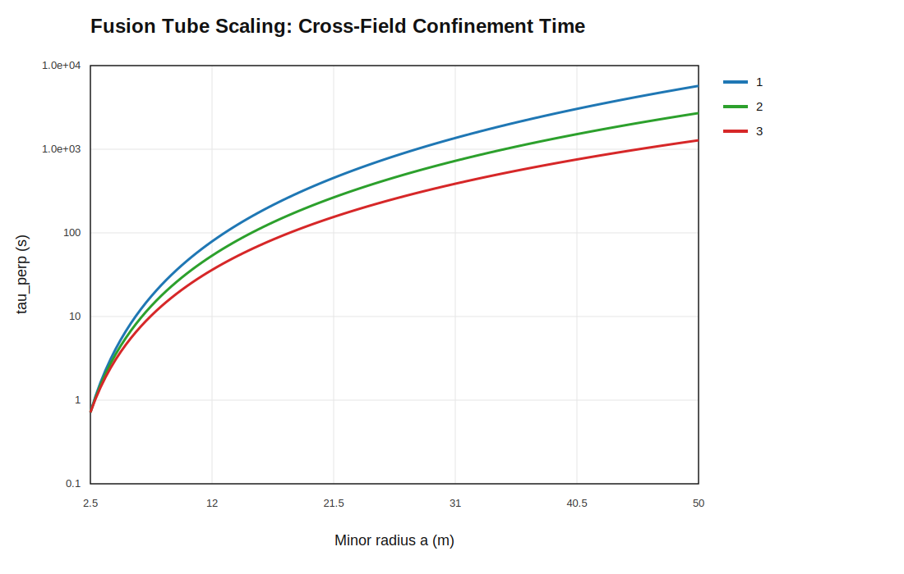
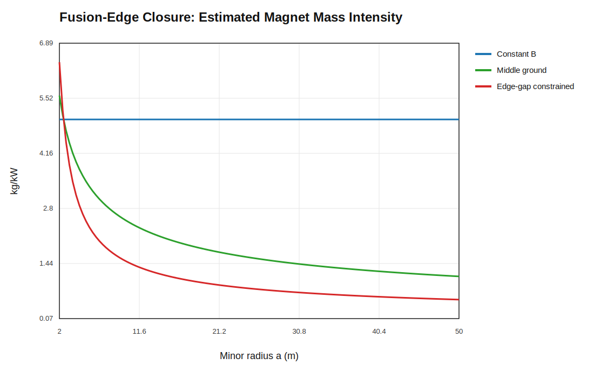

# Active-Area Workbook Plots

This page collects the active-area scaling workbook figures, the direct orbit-ratio constraint, and the confinement-time bookkeeping in one place.

## B Scaling

This is the field-strength path for the three scenarios:

- constant `B`
- `B` only as required
- middle ground

It shows how much field remains as the machine scales.


## Density Scaling

This shows the beta-limited density ceiling associated with each field path.
Lower `B` means lower allowable density at fixed beta.


## Required Active Area

This is the active cross-sectional area needed to hit the wall-limited power target.
It is the plasma-side quantity that expands when density is reduced.


## Required Line Inventory

This is the plasma inventory per unit length, `λ = n A_f`.
It is the direct measure of how much plasma must be present to sustain the target power density.


## Active-Area Orbit Proxy

This is a surrogate, not the direct `ρ/a` graph.
It tracks `ρ / sqrt(A_req)` so the workbook can compare orbit size against the required active area.


## Estimated Magnet Mass Intensity

This is the magnet-side burden estimate in `kg/kW`.
It is calibrated so lower `B` gives a lower magnet-mass intensity.


## Wall-Limited Power Target

This shows the target power-per-length curve set by the wall heat-flux constraint.
It is the engineering ceiling the plasma must meet.


## Orbit-Ratio Constraint

This is the direct `ρ/a` argument behind the `B only as required` case.
If `B(a) ∝ 1/a`, then `ρ ∝ 1/B ∝ a`, so the normalized orbit ratio stays flat:

```text
ρ/a = constant
```

That is the specific requirement being enforced by the minimum-`B` scaling rule.


## Radius Sweep Rebuild

The figures above were originally written against an abstract scale factor.
This section rewrites the same comparisons directly against physical minor
radius `a`, from `2 m` to `50 m`, so the orbit-ratio constraint is visible
without any intermediary normalization.

The underlying equations are:

```text
B(a) = B0 (a0 / a)^γ
ρ = m_i v_th / (|q| B)
a / ρ = a |q| B / (m_i v_th)
```

For the radius sweep:

- the x-axis is actual radius in meters
- the baseline is the shared `2 m` reference point
- scenario 2 is the middle-ground field law
- scenario 3 is the orbit-ratio-constrained minimum-`B` law

### B Scaling vs Radius

This is the field-strength path rewritten on the physical radius axis.
It shows the same three field postures, but now the x-axis is the actual machine size.



### Density Scaling vs Radius

This shows the beta-limited density ceiling on the same radius axis.
Lower `B` still means lower allowable density at fixed beta, but now the trend is tied to `a` directly.



### Required Line Inventory vs Radius

This is the plasma inventory per unit length, `λ = n A_f`, under the wall-flux-scaled power target.
It is the most direct plasma-side quantity in the workbook.



### Orbit-Ratio Constraint vs Radius

This is the version the trust issue was really about.
It uses the real gyroradius equation and shows `a/ρ` directly against physical radius.
The orbit-ratio-constrained case stays flat because `B ∝ 1/a`; the middle-ground case rises more slowly; the constant-`B` case rises fastest.
This is the simpler whole-chamber view. The transport closure below uses the full radius rather than an edge-gap proxy.



## Fusion Transport Closure

The radius sweep still needs a cross-field transport closure. This section adds
the missing radial-loss estimate without pretending the plasma edge is the main
geometric object.
It is the detailed workbook version of the same wall-loading / beta-limited
closure summarized in [accepted_closures/beta_wall_fill_scaling.md](/home/arominge/repos/giant_fusion/analysis/accepted_closures/beta_wall_fill_scaling.md).
The summary table now tracks `beta`, and the companion note adds a separate
confinement-time and total-quantity bookkeeping view.

The transport closure is:

```text
tau_perp ~ a^2 / D_perp
```

The end scrape-off / direct-conversion region is still a separate axial problem.

The calibration here is deliberately closer to a reactor-grade burn point:

- `T = 15 keV`
- `beta = 3%`
- `B0 = 5.3 T`
- `P/L` anchored to a near-future reactor-scale line power

This table is the fixed-beta operating point. For an explicit field-versus-beta
allocation law, see [beta_budget_allocation.md](/home/arominge/repos/giant_fusion/analysis/beta_budget_allocation.md).

### B Scaling with Transport Closure

This is the field path after the radial-loss closure is imposed.
The low-field branch no longer gets to ignore cross-field transport.



### Radius-Based Confinement Time

This is the confinement-time proxy based on `a^2 / D_perp`.
It is the metric that tells you how long a particle stays cross-field trapped
in the core transport picture.



### Magnet Burden

This is the same real-unit coil burden proxy, now evaluated after the transport closure.



The full turnover and total-quantity bookkeeping is in
[confinement_time_and_totals.md](/home/arominge/repos/giant_fusion/analysis/confinement_time_and_totals.md).

## Scenario Summary Table

This first table names the three cases in plain language.

| Scenario | What it means | Field posture | What it buys | What it costs |
|---|---|---|---|---|
| 1 | Proof of scaling | Keep `B` fixed at the reference field. | Best orbit margin at large radius and the simplest comparison case. | Highest field burden if the field is pushed high. |
| 2 | Middle ground | Relax `B` partway between the fixed-field case and the strongest field-relaxation case. | Trades some magnet burden away without giving up too much orbit margin. | Not as simple as constant `B`, and not as aggressive as the strongest falling-field idea. |
| 3 | Transport-limited minimum-`B` | Relax `B` until the chosen `D_perp` closure stops improving fast enough to justify more field reduction. | Lowest magnet burden among the three cases. | Most aggressive on radial confinement, so it is the least forgiving transport branch. |

## Total Quantity Table

This is the 1 TWe plant-level bookkeeping table.
The values are the same ones expanded in [confinement_time_and_totals.md](/home/arominge/repos/giant_fusion/analysis/confinement_time_and_totals.md).
The tube length is still set by the conservative wall-loading anchor, so it is
longer than the earlier 12 km intuition.
The reference wall-loading ceiling is `3 MW/m^2` average here, with
`1-3 MW/m^2` still a reasonable planning range for an actively pumped liquid wall.
The efficiency assumption is `60%`.

| Scenario | Radius | Tube length | Coil mass | Structural mass |
|---|---|---:|---:|---:|
| baseline | `2.5 m` | `35368 m` | `5.00 Mt` | `10.00 Mt` |
| 1 | `50 m` | `1768 m` | `5.00 Mt` | `10.00 Mt` |
| 2 | `50 m` | `1768 m` | `2.36 Mt` | `3.25 Mt` |
| 3 | `50 m` | `1768 m` | `1.12 Mt` | `1.06 Mt` |

## Specific Power Table

This repeats the total-quantity table, but expresses the mass columns as
`W/kg` using the `1 TWe` electric target in the numerator.

| Scenario | Radius | Tube length | Coil burden | Structural burden | Combined burden |
|---|---|---:|---:|---:|---:|
| baseline | `2.5 m` | `35368 m` | `200.00 W/kg` | `100.00 W/kg` | `66.67 W/kg` |
| 1 | `50 m` | `1768 m` | `200.00 W/kg` | `100.00 W/kg` | `66.67 W/kg` |
| 2 | `50 m` | `1768 m` | `422.95 W/kg` | `307.53 W/kg` | `178.06 W/kg` |
| 3 | `50 m` | `1768 m` | `894.43 W/kg` | `945.74 W/kg` | `459.68 W/kg` |

## Beta Budget Table

This table uses the explicit allocation parameter `eta` from the beta-budget
note. It is the clean way to let the beta column vary by scenario instead of
holding it flat.

The allocation law is:

```text
lambda = a / a0
B = B0 * lambda^(-eta/4)
beta = beta0 * lambda^(-(1 - eta)/2)
```

with:

- scenario 1: `eta = 0`
- scenario 2: `eta = 0.5`
- scenario 3: `eta = 1`

For the DEMO-like anchor here, `a0 = 2.5 m`, `B0 = 5.86 T`, and `beta0 = 3%`.

| Scenario | Radius | `eta` | `B` | `beta` | `a/rho` factor | Confinement time |
|---|---|---:|---:|---:|---:|---:|
| baseline | `2.5 m` | - | `5.86 T` | `3.0%` | `1.000` | `0.715 s` |
| 1 | `50 m` | `0.0` | `5.86 T` | `0.67%` | `20.00` | `1.59 h` |
| 2 | `50 m` | `0.5` | `4.03 T` | `1.42%` | `13.75` | `45.07 min` |
| 3 | `50 m` | `1.0` | `2.77 T` | `3.0%` | `9.46` | `21.31 min` |

The important reading is:

- scenario 1 spends the size dividend on beta reduction
- scenario 2 splits the dividend between field and beta
- scenario 3 spends the dividend on retaining field, so beta stays at the baseline operating value
- all three branches still benefit strongly from the larger radius in `a/rho`
- the support-structure burden falls more slowly than conductor burden, so the structural-to-conductor ratio is highest in the high-field branches
- the confinement-time proxy grows strongly as the field is retained, which is why the constant-field branch has the largest time margin in this table

For a real coil mass estimate, the geometry of the coils would still need to be specified.
For now, `B` and `beta` are the cleanest high-level operating numbers.

## Stability Issues

The giant tube introduces its own stability questions. The main ones are
tracked in [giant_tube_stability_issues.md](/home/arominge/repos/giant_fusion/analysis/giant_tube_stability_issues.md).
