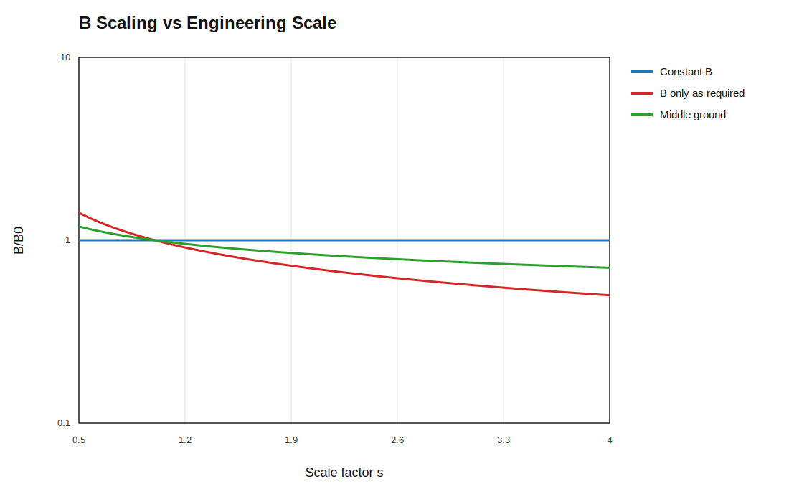
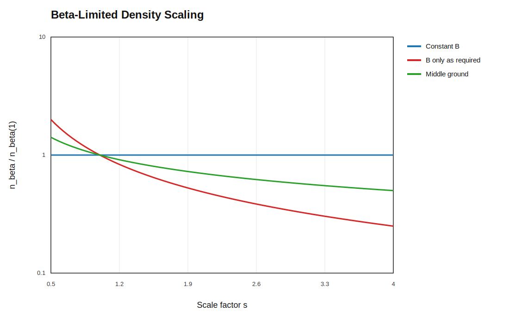
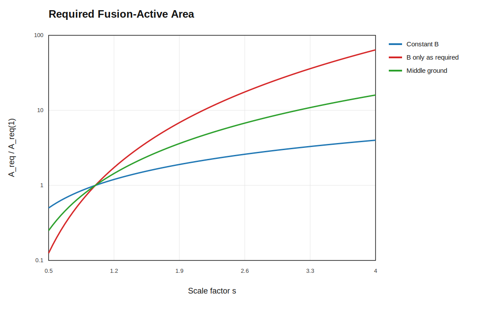
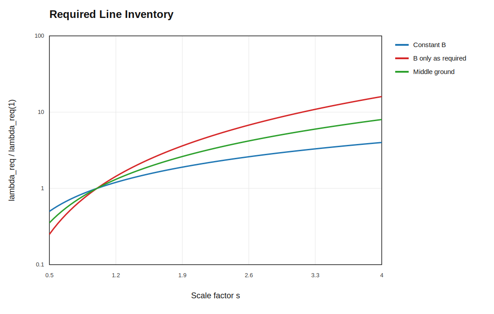
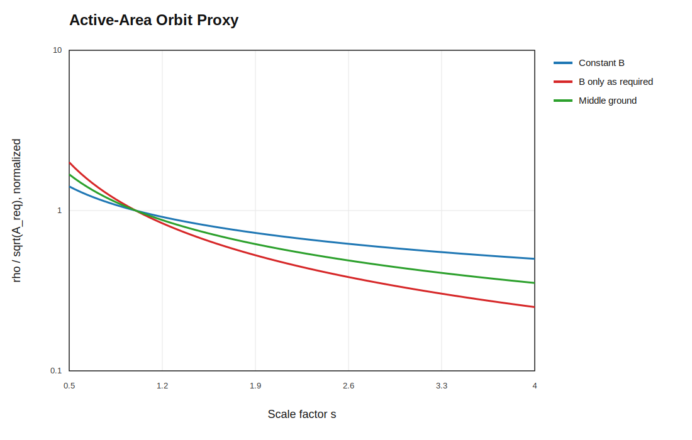
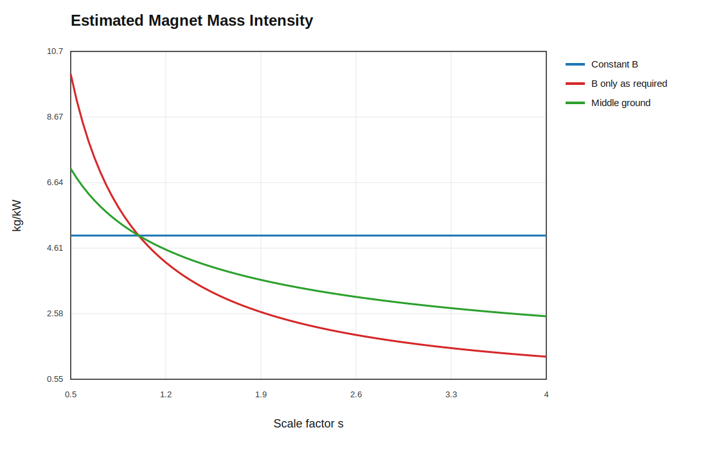
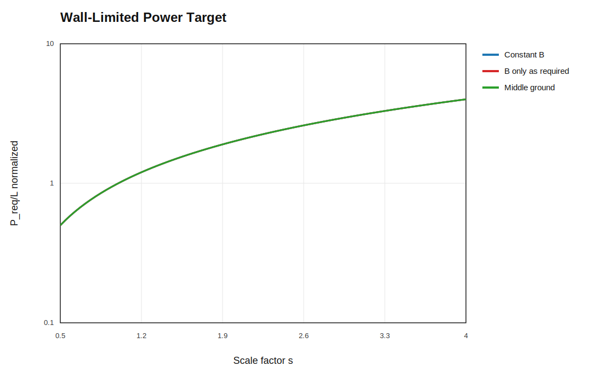
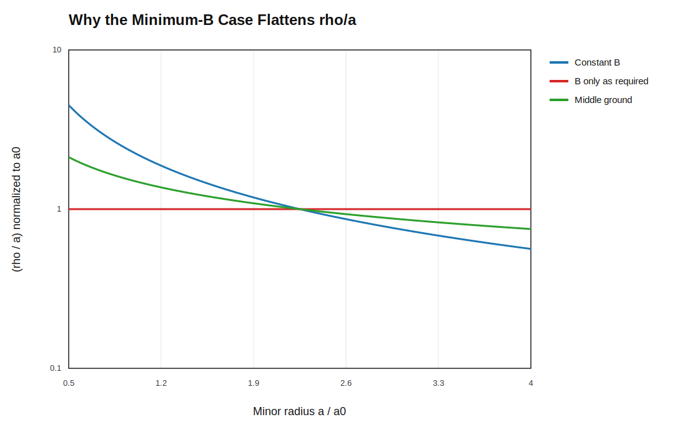

# Active-Area Workbook Plots

This page collects the active-area scaling workbook figures and the direct orbit-ratio constraint in one place.

## B Scaling

This is the field-strength path for the three scenarios:

- constant `B`
- `B` only as required
- middle ground

It shows how much field remains as the machine scales.



## Density Scaling

This shows the beta-limited density ceiling associated with each field path.
Lower `B` means lower allowable density at fixed beta.



## Required Active Area

This is the active cross-sectional area needed to hit the wall-limited power target.
It is the plasma-side quantity that expands when density is reduced.



## Required Line Inventory

This is the plasma inventory per unit length, `λ = n A_f`.
It is the direct measure of how much plasma must be present to sustain the target power density.



## Active-Area Orbit Proxy

This is a surrogate, not the direct `ρ/a` graph.
It tracks `ρ / sqrt(A_req)` so the workbook can compare orbit size against the required active area.



## Estimated Magnet Mass Intensity

This is the magnet-side burden estimate in `kg/kW`.
It is calibrated so lower `B` gives a lower magnet-mass intensity.



## Wall-Limited Power Target

This shows the target power-per-length curve set by the wall heat-flux constraint.
It is the engineering ceiling the plasma must meet.



## Orbit-Ratio Constraint

This is the direct `ρ/a` argument behind the `B only as required` case.
If `B(a) ∝ 1/a`, then `ρ ∝ 1/B ∝ a`, so the normalized orbit ratio stays flat:

```text
ρ/a = constant
```

That is the specific requirement being enforced by the minimum-`B` scaling rule.



## Scenario Summary Table

This first table names the three cases in plain language.

| Scenario | What it means | Field posture | What it buys | What it costs |
|---|---|---|---|---|
| 1 | Proof of scaling | Keep `B` fixed at the reference field. | Best orbit margin at large radius and the simplest comparison case. | Highest field burden if the field is pushed high. |
| 2 | Middle ground | Relax `B` partway between the fixed-field and more aggressive falling-field cases. | Trades some magnet burden away without giving up too much orbit margin. | Not as simple as constant `B`, and not as aggressive as the strongest falling-field idea. |
| 3 | Controlled laziness | Relax `B` with scale, but keep the same shared `2 m` anchor as the other cases. | Lowers magnet burden while staying in a familiar reactor-like field range. | Orbit margin improves more slowly than in the idealized minimum-`B` law. |

## Radius Comparison Table

This table uses the same three scenarios at two representative radii: `2 m` and `50 m`.
All three scenarios share the same `B = 10 T` anchor at `2 m`; the differences show up as the radius grows.
For readability, the margin is reported as `a/ρ`, which is just the inverse of the direct orbit ratio.

The field and orbit relations are:

```text
ρ / a = [m_i v_⊥ / (|q| B)] / a
a / ρ = 1 / (ρ / a)
p_B = B^2 / (2μ0)
```

Here `p_B` is the burden proxy. It is not the full coil mass, but it is the magnetic-pressure scale that drives support and structural loading.

| Scenario | Radius | `B` | `a/ρ` | `p_B` | `Magnet Mass Intensity` |
|---|---|---:|---:|---:|---:|
| 1 | `2 m` | `10 T` | `346x` | `39.8 MPa` | `5.0 kg/kW` |
| 1 | `50 m` | `10 T` | `8650x` | `39.8 MPa` | `5.0 kg/kW` |
| 2 | `2 m` | `34.6 T` | `1199x` | `477 MPa` | `60.0 kg/kW` |
| 2 | `50 m` | `8.32 T` | `7202x` | `27.6 MPa` | `2.4 kg/kW` |
| 3 | `2 m` | `18.6 T` | `644x` | `137.8 MPa` | `17.3 kg/kW` |
| 3 | `50 m` | `6.93 T` | `5995x` | `19.1 MPa` | `3.46 kg/kW` |

The important reading is:

- at `2 m`, the scenarios separate because the workbook’s field law is already active at the anchor radius
- scenario 1 keeps `B` fixed, so the orbit margin is best at large radius but the field burden stays high
- scenario 2 is the compromise case between the two field-relaxation options
- scenario 3 relaxes `B` more aggressively, so the field burden falls further at large radius

For a real coil mass estimate, the geometry of the coils would still need to be specified.
For now, `p_B` is the cleanest high-level burden number.

Implied `B` at `50 m` for the three scenarios:

- Scenario 1: `10 T`
- Scenario 2: `8.32 T`
- Scenario 3: `6.93 T`
