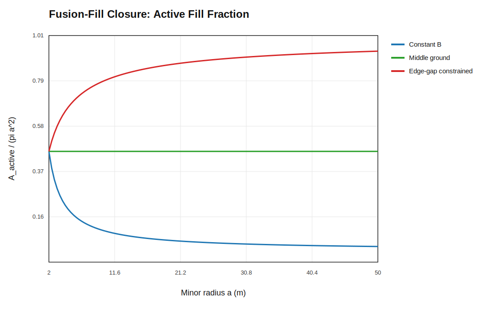
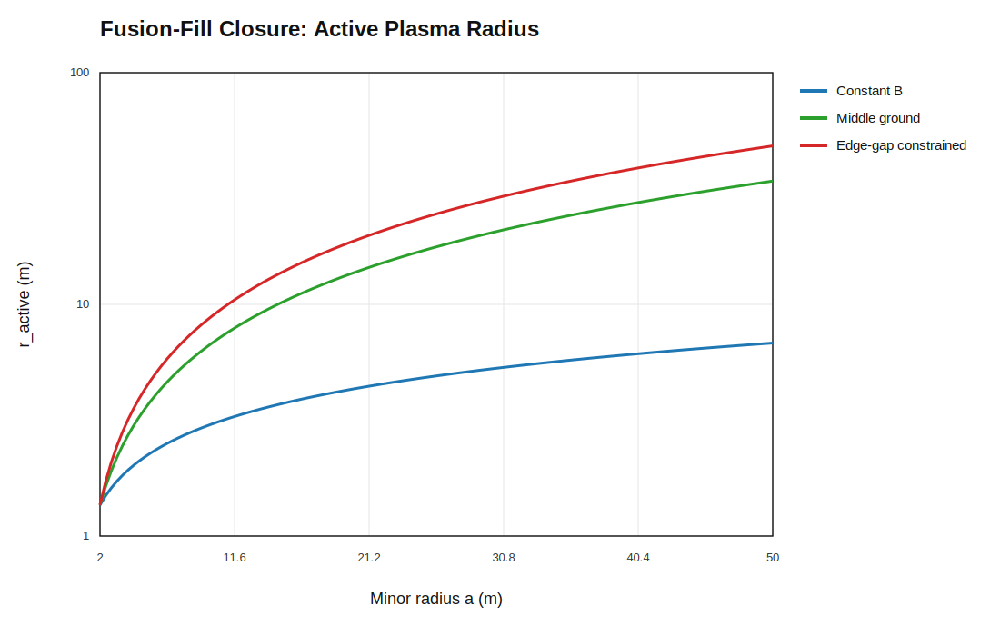
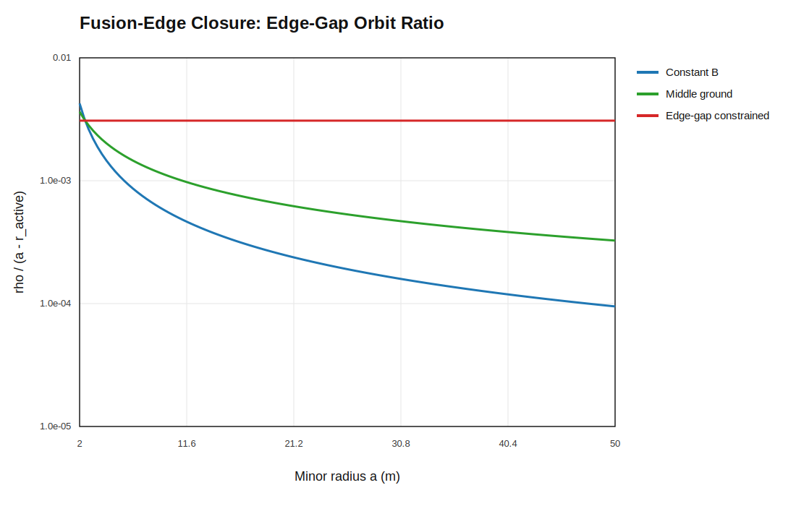

# Active-Area Workbook Plots

This page collects the active-area scaling workbook figures and the direct orbit-ratio constraint in one place.

## B Scaling

This is the field-strength path for the three scenarios:

- constant `B`
- `B` only as required
- middle ground

It shows how much field remains as the machine scales.


## Density Scaling

This shows the beta-limited density ceiling associated with each field path.
Lower `B` means lower allowable density at fixed beta.


## Required Active Area

This is the active cross-sectional area needed to hit the wall-limited power target.
It is the plasma-side quantity that expands when density is reduced.


## Required Line Inventory

This is the plasma inventory per unit length, `λ = n A_f`.
It is the direct measure of how much plasma must be present to sustain the target power density.


## Active-Area Orbit Proxy

This is a surrogate, not the direct `ρ/a` graph.
It tracks `ρ / sqrt(A_req)` so the workbook can compare orbit size against the required active area.


## Estimated Magnet Mass Intensity

This is the magnet-side burden estimate in `kg/kW`.
It is calibrated so lower `B` gives a lower magnet-mass intensity.


## Wall-Limited Power Target

This shows the target power-per-length curve set by the wall heat-flux constraint.
It is the engineering ceiling the plasma must meet.


## Orbit-Ratio Constraint

This is the direct `ρ/a` argument behind the `B only as required` case.
If `B(a) ∝ 1/a`, then `ρ ∝ 1/B ∝ a`, so the normalized orbit ratio stays flat:

```text
ρ/a = constant
```

That is the specific requirement being enforced by the minimum-`B` scaling rule.


## Radius Sweep Rebuild

The figures above were originally written against an abstract scale factor.
This section rewrites the same comparisons directly against physical minor
radius `a`, from `2 m` to `50 m`, so the orbit-ratio constraint is visible
without any intermediary normalization.

The underlying equations are:

```text
B(a) = B0 (a0 / a)^γ
ρ = m_i v_th / (|q| B)
a / ρ = a |q| B / (m_i v_th)
```

For the radius sweep:

- the x-axis is actual radius in meters
- the baseline is the shared `2 m` reference point
- scenario 2 is the middle-ground field law
- scenario 3 is the orbit-ratio-constrained minimum-`B` law

### B Scaling vs Radius

This is the field-strength path rewritten on the physical radius axis.
It shows the same three field postures, but now the x-axis is the actual machine size.


### Density Scaling vs Radius

This shows the beta-limited density ceiling on the same radius axis.
Lower `B` still means lower allowable density at fixed beta, but now the trend is tied to `a` directly.


### Required Line Inventory vs Radius

This is the plasma inventory per unit length, `λ = n A_f`, under the wall-flux-scaled power target.
It is the most direct plasma-side quantity in the workbook.


### Orbit-Ratio Constraint vs Radius

This is the version the trust issue was really about.
It uses the real gyroradius equation and shows `a/ρ` directly against physical radius.
The orbit-ratio-constrained case stays flat because `B ∝ 1/a`; the middle-ground case rises more slowly; the constant-`B` case rises fastest.
This is the simpler whole-chamber view. The fusion-fill closure below replaces the denominator with the remaining edge gap `a - r_active`.


## Fusion-Fill Closure

The radius sweep still has one failure mode: it can make the fusion-active region
so large that it fills the chamber. This section adds the missing geometric cap.
It is the detailed workbook version of the same wall-loading / beta-limited
closure summarized in [accepted_closures/beta_wall_fill_scaling.md](/home/arominge/repos/giant_fusion/analysis/accepted_closures/beta_wall_fill_scaling.md).

The new definitions are:

```text
A_active = A_req
r_active = sqrt(A_active / π)
f_fill = A_active / (π a^2)
edge_gap = a - r_active
```

The orbit metric is then measured against the remaining edge gap:

```text
rho / (a - r_active)
```

That keeps the scenario 3 idea, but applies it to the actual plasma edge rather
than to the full chamber radius.

The calibration here is deliberately closer to a reactor-grade burn point:

- `T = 15 keV`
- `beta = 3%`
- `B0 = 5.3 T`
- `P/L` anchored to a near-future reactor-scale line power

### B Scaling with Fill Closure

This is the field path after the fill constraint is imposed.
The low-field branch no longer gets to hide behind an unbounded active radius.


### Active Fill Fraction

This is the key new occupancy metric.
It shows how much of the chamber cross-section is actually occupied by fusion-active plasma.



### Active Plasma Radius

This is the equivalent radius of the fusion-active zone, derived from `A_active`.



### Edge-Gap Orbit Ratio

This is the corrected orbit-margin measure.
The numerator is still the gyroradius, but the denominator is now the remaining
gap to the edge of the active fusion region.



### Magnet Burden

This is the same real-unit coil burden proxy, now evaluated after the fill closure.


## Scenario Summary Table

This first table names the three cases in plain language.

| Scenario | What it means | Field posture | What it buys | What it costs |
|---|---|---|---|---|
| 1 | Proof of scaling | Keep `B` fixed at the reference field. | Best orbit margin at large radius and the simplest comparison case. | Highest field burden if the field is pushed high. |
| 2 | Middle ground | Relax `B` partway between the fixed-field case and the strongest field-relaxation case. | Trades some magnet burden away without giving up too much orbit margin. | Not as simple as constant `B`, and not as aggressive as the strongest falling-field idea. |
| 3 | Edge-gap constrained | Relax `B` until `rho / (a - r_active)` stays flat by construction. | Keeps the orbit margin tied to the remaining edge gap instead of the whole chamber. | The fusion-active region is allowed to grow only until it starts crowding the edge. |

## Fill-Closure Table

This table matches the accepted fill-closure model above, not the older
whole-chamber `1/a` simplification. Scenario 3 is therefore no longer `0.4 T`
at `50 m`; it is the edge-gap-constrained value from the new closure.

The field and orbit relations are:

```text
A_active = A_req
r_active = sqrt(A_active / π)
edge_gap = a - r_active
rho / (a - r_active) = constant for the constrained case
p_B = B^2 / (2μ0)
```

Here `p_B` is still the burden proxy. It is not the full coil mass, but it is
the magnetic-pressure scale that drives support and structural loading.

| Scenario | Radius | `B` | `r_active` | `fill fraction` | `rho / (a - r_active)` |
|---|---|---:|---:|---:|---:|
| baseline | `2 m` | `5.30 T` | `1.362 m` | `0.464` | `0.00740` |
| 1 | `50 m` | `5.30 T` | `6.811 m` | `0.0186` | `0.000109` |
| 2 | `50 m` | `2.37 T` | `34.055 m` | `0.464` | `0.000662` |
| 3 | `50 m` | `1.99 T` | `48.302 m` | `0.933` | `0.00740` |

The important reading is:

- the baseline row is the shared reference point
- scenario 1 keeps `B` fixed and leaves a very small active fill fraction at large radius
- scenario 2 is the compromise case between the fixed-field case and the edge-gap-constrained case
- scenario 3 enforces the edge-gap orbit constraint, so the active plasma nearly fills the chamber but does not exceed it

For a real coil mass estimate, the geometry of the coils would still need to be specified.
For now, `p_B` remains the cleanest high-level burden number.
